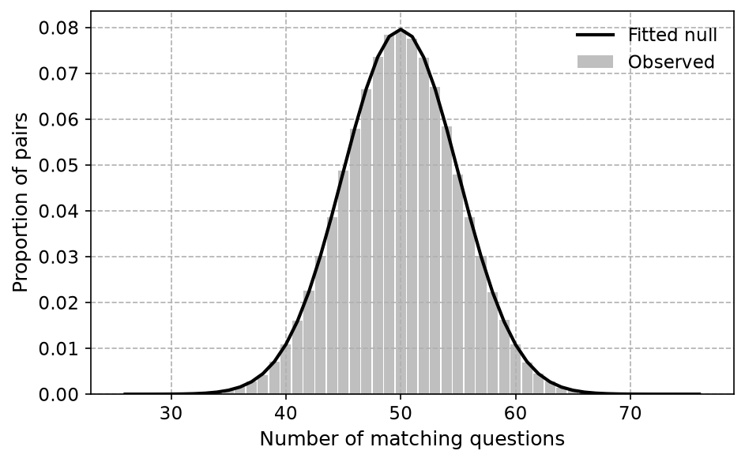
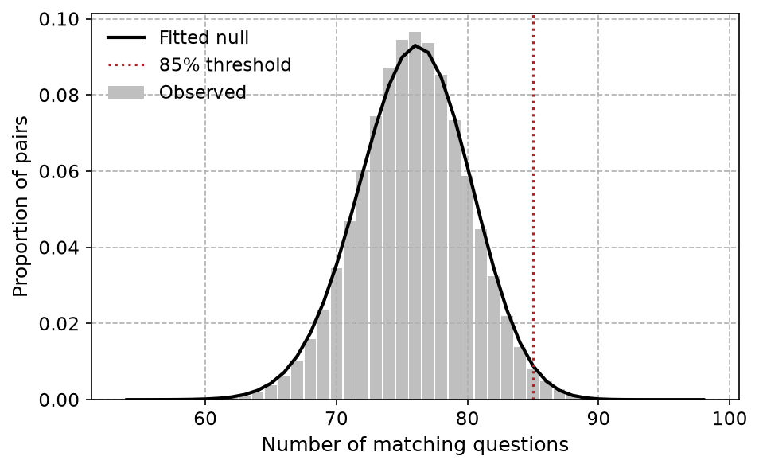
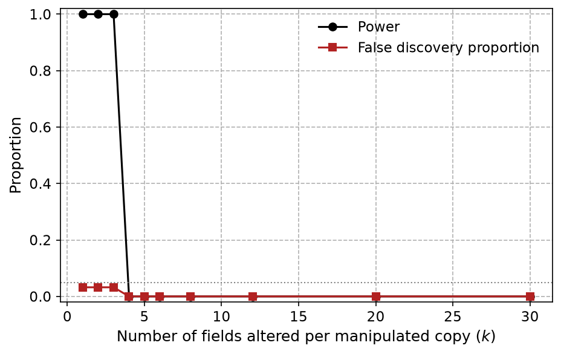
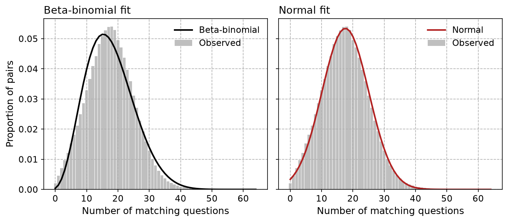

# Identifying near-duplicate survey responses: full-distribution matching with false discovery control
Andrew P. Wheeler

# Introduction

Survey researchers routinely need to flag suspicious duplicate responses: a paper respondent whose form was scanned twice, a web panelist replaying the same session, or a data-entry error that copied one row into another. Kuriakose and Robbins ([2016](#ref-kuriakose2016)) proposed a simple screen for this: compute the percentage of questions on which each pair of respondents gave an identical answer, and flag any pair above 85%. Simmons et al. ([2016](#ref-pewresearch2016)) and Day, Brauer, and Kotlaja ([2023](#ref-day2023trustissues)) each point out the same problem with a fixed threshold: how often two independent, honest respondents agree by chance depends entirely on how the response categories are distributed, not on any threshold that generalizes across surveys. A battery of Likert items dominated by a few common answers can put the *large majority* of pairs above 85% agreement with no duplication at all, while a survey with many balanced, high-cardinality items will rarely reach that rate even for a genuine copy.

This paper develops a full-distribution alternative. Rather than comparing each pair’s match percentage to a fixed cutoff, I estimate the distribution of match counts across every pair of respondents in the survey and flag pairs that are outliers relative to that fitted distribution. Because every respondent takes part in $n-1$ comparisons, the resulting test statistics are highly dependent, so the multiple-comparisons correction needs to tolerate that dependence rather than assume independent tests. I also analyze the *entire* set of pairwise comparisons rather than each respondent’s single largest match: reducing the problem to one extreme value per respondent needlessly complicates the analysis and can miss a respondent who was copied into several near-duplicates rather than just one.

The method is a screening tool, not a fraud determination. A flagged pair is a candidate for follow-up review, and the paper’s real-data example shows that most flagged clusters have an ordinary explanation – a respondent who gave the same Likert response to nearly every item. The contribution is calibration: knowing which pairs are actually unusual, given the survey’s own response distributions, rather than applying a rule of thumb that was calibrated on a different survey with different marginals.

# Related work

Kuriakose and Robbins ([2016](#ref-kuriakose2016)) is the starting point for this literature: a fixed percentage-match rule intended to flag fabricated survey data. Simmons et al. ([2016](#ref-pewresearch2016)) critiqued the rule using Pew’s own cross-national surveys, showing that many genuine respondent pairs exceed 85% agreement simply because several items have highly skewed response distributions. Day, Brauer, and Kotlaja ([2023](#ref-day2023trustissues)) independently reached the same conclusion auditing a university’s own survey data, and both critiques motivate the approach here: model the actual distribution of matches for the survey at hand instead of importing a threshold from another one.

The method is also distinct from probabilistic record linkage ([Fellegi and Sunter 1969](#ref-fellegisunter1969); [Enamorado, Fifield, and Imai 2019](#ref-enamorado2019)), which weights field-by-field agreement by how informative each field is and is normally used to merge or de-duplicate records *across* separate files where true matches are rare and fields are a mix of continuous and categorical types. Here every respondent answers the same fixed categorical instrument, matches are compared within a single fielded survey, and the goal is to characterize the entire distribution of agreement rather than to score one-off candidate matches.

Comparing response *patterns* also appears in test-fraud detection. Jacob and Levitt ([2003](#ref-jacoblevitt2003)) flag classrooms with unusual within-classroom agreement on blocks of answers, including agreement on wrong answers, which is a stronger signal than agreement alone but requires an answer key that a general opinion survey does not have. Fabricated data can also be detected by non-content forensic cues – sorting artifacts, implausible formatting – as in Simonsohn, Simmons, and Nelson ([2023](#ref-datacolada2023)), and web-panel administrators can use paradata such as IP addresses and timestamps ([Data@Urban 2023](#ref-urbaninstitute2023)) that are unavailable for a paper instrument like the one analyzed in this paper. Response-content matching is a complementary signal to all of these, useful precisely when paradata and answer keys are not available.

The mean number of matches two independent respondents share on a single question is the sum of squared response-category proportions, i.e. the complement of the Gini–Simpson diversity index ([Simpson 1949](#ref-simpson1949)). Skewed marginals mechanically inflate this quantity, which is the mathematical root of the miscalibration problem described above. Finally, because comparing every respondent to every other respondent produces $\binom{n}{2}$ dependent test statistics, the relevant correction is a false discovery rate procedure that tolerates dependent tests ([Benjamini and Hochberg 1995](#ref-benjaminihochberg1995); [Benjamini and Yekutieli 2001](#ref-benjaminiyekutieli2001)), discussed further below.

# Method

## Setup

Each of $n$ respondents answers $v$ categorical questions. Question $c$ has $K_c$ response categories with population proportions $p_{c1},\dots,p_{cK_c}$. For a pair of respondents $i \neq j$, define the match count

```math
M_{ij} = \sum_{c=1}^v \mathbb{1}\{X_{ic} = X_{jc}\},
```

the number of questions on which they gave the identical answer. The method compares every one of the $\binom{n}{2}$ values of $M_{ij}$ to a fitted null distribution, rather than thresholding $M_{ij}/v$ against a fixed rate.

## Expected matches under independence

For two respondents drawn independently from the population, the probability they match on question $c$ depends only on that question’s marginal distribution:

```math
\theta_c = \Pr(X_{ic}=X_{jc}) = \sum_{k=1}^{K_c} p_{ck}^2.
```

Summing over questions gives the expected total match count, $\mu=\sum_c \theta_c = E[M_{ij}]$, exactly, with no assumption about correlation between questions *within* a respondent. That correlation instead determines $\mathrm{Var}(M_{ij})$: correlated answers make the per-question match indicators correlated for a given pair, inflating the variance of $M_{ij}$ above what independence would imply while leaving its mean unchanged. This is the mechanism behind <a href="#sec-sim2" class="quarto-xref">Section 4.2</a> below – a handful of dominant response categories can push $\mu$ itself above a naive 85% threshold, with no need for any correlation or duplication at all.

If the $v$ questions were independent given respondent identity, $M_{ij}$ would follow a Poisson-binomial distribution with success probabilities $\theta_1,\dots,\theta_v$, computable exactly by a standard $O(v^2)$ convolution recursion (implemented in `poisson_binomial_null`). Real survey items are rarely independent within a respondent – response styles, acquiescence, and genuinely correlated attitudes all push several items in the same direction for the same person – so this exact null understates $\mathrm{Var}(M_{ij})$ for real data. It remains useful as a check: when questions really are independent, as in the simulation of <a href="#sec-sim1" class="quarto-xref">Section 4.1</a>, the Poisson-binomial and an empirically fit null should agree closely.

## An empirically fit null

Rather than assume independence, I fit an overdispersed distribution directly to the observed $\binom{n}{2}$ match counts. The primary choice is a beta-binomial, $M \sim \mathrm{BetaBinomial}(v,\alpha,\beta)$, fit by maximum likelihood. A closed-form method-of-moments estimator exists but is unstable near the boundary of valid $(\alpha,\beta)$; direct likelihood maximization is used throughout (`fit_beta_binomial_ml`). When match counts are *under*-dispersed relative to a binomial – rare in practice, since it implies a survey with less pairwise agreement than independent chance would produce – the method-of-moments algebra returns an invalid negative $\alpha$ or $\beta$, in which case a normal approximation matched to the sample mean and standard deviation is used instead (`fit_normal_approx`). The real-data application in this paper also uses the normal approximation, chosen automatically because it fits the observed histogram better than the beta-binomial’s maximum-likelihood fit (measured by sum of squared error against the empirical histogram, `null_fit_sse`); see <a href="#sec-realdata" class="quarto-xref">Section 5</a>.

Given a fitted null $\hat F$, each pair receives a one-sided p-value, $p_{ij} = \Pr(M \ge m_{ij}) = 1-\hat F(m_{ij}-1)$, evaluated here as $1-\hat F(m_{ij})$ for a slightly conservative discrete convention.

## Multiple comparisons under dependence

Testing all $\binom{n}{2}$ pairs is a large multiple-comparisons problem, and the tests are not independent: every respondent appears in $n-1$ of them, so a respondent with an unusually common response profile inflates several $p_{ij}$ at once. The Benjamini–Hochberg procedure ([Benjamini and Hochberg 1995](#ref-benjaminihochberg1995)) controls the false discovery rate under independence or positive regression dependence, while the Benjamini–Yekutieli procedure ([Benjamini and Yekutieli 2001](#ref-benjaminiyekutieli2001)) controls it under arbitrary dependence at the cost of being more conservative. <a href="#sec-calibration" class="quarto-xref">Section 4.4</a> checks both empirically and finds that Benjamini–Hochberg is already somewhat liberal purely from respondent-sharing, even with independent questions, and that its excess false-flag rate grows sharply once questions are also correlated within a respondent. Benjamini–Yekutieli is better calibrated throughout that range, though its protection is not unconditional either – at strong enough item correlation both procedures break down together. This motivates using Benjamini–Yekutieli as the safer default, and specifically for the real, correlated survey data in <a href="#sec-realdata" class="quarto-xref">Section 5</a>.

## Grouping flagged pairs

Flagging pairs rather than respondents means one respondent’s row can appear in several flagged pairs – for instance if it was the source of a copy that was then further altered. I therefore treat the flagged pairs as edges of a graph and extract its connected components (`connected_components`), which groups respondents into clusters of mutual near-duplication rather than forcing an analyst to reassemble that structure from a flat pair list.

# Simulated examples

## Baseline calibration

As a first check, I replicate Kuriakose and Robbins ([2016](#ref-kuriakose2016))’s original simulation: 1,000 respondents answer 100 independent, evenly split yes/no questions. <a href="#fig-sim1" class="quarto-xref">Figure 1</a> compares the observed distribution of the 499,500 pairwise match counts against the maximum-likelihood beta-binomial fit. Because the questions are genuinely independent here, the fitted beta-binomial mean (50.0) and variance (25.00) closely track the exact Poisson-binomial null’s mean (50.0) and variance (25.00), confirming the empirical fit recovers the right answer when the textbook independence assumption actually holds. At a 5% false discovery rate, Benjamini–Hochberg flags 0 pair(s) out of 499,500 – consistent with testing this many true nulls at that error rate, not evidence of any real duplication.



## Skewed marginals: a red herring

A fixed match-rate threshold implicitly assumes every survey produces about the same chance agreement rate. <a href="#fig-sim2" class="quarto-xref">Figure 2</a> shows a simple counter-example: the same number of respondents and questions as <a href="#sec-sim1" class="quarto-xref">Section 4.1</a>, but each question is now drawn from one of three skewed distributions with a single dominant response category (as could arise from a battery of Likert items with strong ceiling effects). No duplication or manipulation is introduced anywhere. Summing the per-question collision probabilities gives an expected match rate of 76% of all 100 questions – already close to the 85% rule-of-thumb threshold from chance alone. In the simulated sample, 8,961 of the 499,500 pairs (1.8%) exceed the naive 85% match rate, which a fixed-threshold rule would flag as suspicious. The calibrated approach instead fits the null to this survey’s own marginals and flags 0 pairs at a 5% false discovery rate, correctly finding nothing unusual.



## Detecting manipulated duplicates

The scenario the method is actually meant to catch is deliberate but lazy duplication: copying an existing response and changing a handful of fields. Starting from a skewed-marginal population like <a href="#sec-sim2" class="quarto-xref">Section 4.2</a> (300 respondents, 60 questions), I copy 30 rows, randomly alter $k$ of the $v_3$ fields in each copy, and check whether the true copy-original pairs are recovered. <a href="#fig-sim3-power" class="quarto-xref">Figure 3</a> shows detection power – the fraction of the 30 true duplicate pairs correctly flagged – and the false discovery proportion among flagged pairs, averaged over 12 replications at each value of $k$. Power is high when only a few fields are altered and falls as $k$ grows, which is an unavoidable property of exact-field matching rather than a weakness of the correction: once enough fields differ, a manipulated copy is no longer statistically distinguishable from an independent respondent who happens to share the same skewed marginals. The false discovery proportion stays controlled near the nominal 5% level throughout, so the method does not compensate for lost power by flagging more false positives.



## Choosing an FDR procedure under correlated items

<a href="#sec-sim1" class="quarto-xref">Section 4.1</a> and <a href="#sec-sim2" class="quarto-xref">Section 4.2</a> use independent questions, but that alone does not make the $\binom{n}{2}$ pairwise tests independent of each other: every respondent contributes to $n-1$ of them, which is enough dependence by itself to matter. <a href="#tbl-bhby" class="quarto-xref">Table 1</a> simulates 250 respondents on 25 questions whose answers share a common respondent-level trait of increasing strength $\rho$ (so $\rho=0$ isolates pure respondent-sharing dependence, and larger $\rho$ adds real within-respondent item correlation on top of it), with the beta-binomial null re-fit to each simulated sample and no true duplicates present. Because no true duplicates exist, any rejection is a false one, so the proportion of replications with at least one rejection is directly comparable to the nominal 5% level. Even at $\rho=0$, Benjamini–Hochberg’s false-rejection rate (18%) sits well above 5% from respondent-sharing alone, while Benjamini–Yekutieli stays near or below it (2%). As $\rho$ increases, Benjamini–Hochberg’s excess grows sharply while Benjamini–Yekutieli remains better calibrated over most of this range – though at the highest correlation shown, both procedures flag nearly every replication, which is a reminder that no multiple-comparisons correction can fully compensate for a badly misspecified single overall null once respondents cluster into strongly self-similar subgroups. This is why <a href="#sec-realdata" class="quarto-xref">Section 5</a> below uses Benjamini–Yekutieli for the real, correlated survey data.

<div class="cell-output cell-output-display cell-output-markdown" execution_count="10">

| Correlation (rho) | BH: P(any rejection) | BH: mean \# flagged | BY: P(any rejection) | BY: mean \# flagged |
|------------------:|---------------------:|--------------------:|---------------------:|--------------------:|
|              0.00 |                0.180 |                0.56 |                0.020 |                0.02 |
|              0.30 |                0.340 |                2.78 |                0.180 |                0.30 |
|              0.50 |                0.600 |                4.76 |                0.580 |                1.88 |

</div>

# Application: the 2018 Raleigh community survey

I apply the method to a public block of 64 Likert-style items from the City of Raleigh’s 2018 community survey (1,010 respondents; see the `data/` folder for the source file and codebook). Response categories are collapsed to the integers 1–9, following the source instrument’s coding, with missing values coded 9. This is real fielded data, not a simulation, so I do not know the ground truth of which pairs, if any, are genuine duplicates.

The beta-binomial maximum-likelihood fit visibly underestimates the left skew of the observed match-count distribution for this survey; the automatic goodness-of-fit check confirms the normal approximation is the better fit (sum of squared error 0.00004 vs. 0.00055), so the normal null is used here, exactly as the method’s fallback rule anticipates. <a href="#fig-real-fit" class="quarto-xref">Figure 4</a> shows both fits for comparison. At a 5% false discovery rate with the Benjamini–Yekutieli correction, 25 of the 509,545 pairs are flagged, forming 6 connected components of mutually near-duplicate respondents.



<a href="#tbl-components" class="quarto-xref">Table 2</a> summarizes the flagged clusters. For each, “unanimous items” counts how many of the 64 questions every respondent in the cluster answered identically, and “modal share” is the fraction of all cell values in the cluster equal to its single most common value. Clusters with both figures high are consistent with a respondent giving one repeated response to most of the survey – a long “run” of, say, all 5’s – rather than a copied and lightly edited record. Clusters with lower values on both measures have more varied response patterns and are comparatively harder to explain by a single repeated response.

<div class="cell-output cell-output-display cell-output-markdown" execution_count="12">

| Component | Respondents | Unanimous items (of 64) | Modal value | Modal share |
|----------:|------------:|------------------------:|------------:|------------:|
|         1 |           9 |                      42 |           4 |        0.82 |
|         2 |           6 |                      46 |           5 |        0.83 |
|         3 |           2 |                      62 |           9 |        0.98 |
|         4 |           2 |                      56 |           4 |        0.71 |
|         5 |           2 |                      62 |           3 |        0.34 |
|         6 |           2 |                      62 |           9 |        0.41 |

</div>

Most components have a high count of unanimous items and a high modal share, consistent with respondents who gave the same Likert response – most often a 4, 5, or the missing-data code 9 – across nearly the entire instrument; duplicate flags here most plausibly reflect straight-lining rather than copied records. The remaining components have more varied responses across their unanimous items and a lower modal share, and are correspondingly harder to write off; they are the pairs an analyst reviewing this survey would want to look at individually.

# Discussion

The central point is that “unusual” is relative to a survey’s own response distributions, not a fixed percentage borrowed from a different instrument. Fitting the null directly avoids two opposite failure modes: treating ordinary skewed-marginal agreement as fraud, and letting a genuinely suspicious pattern slide because it falls under an arbitrary cutoff. Testing every pairwise comparison, rather than only the maximum match per respondent, also lets the method surface a respondent duplicated into several near-copies – a pattern a single-comparison approach would only partially recover.

The simulations also show a real limit of the method, not just its strengths: recovery power depends almost entirely on how many fields a manipulator bothered to change, and beyond a modest number of altered fields a deliberately manipulated row is statistically indistinguishable from an independent respondent. This screen is therefore best understood as catching lazy duplication and unintentional retakes, not a determined adversary who is willing to edit most of the record. That is a reasonable division of labor: someone who can systematically and plausibly fabricate an entire response profile is better caught by other means, such as paradata or field experience, not by post-hoc statistical screening of the response content alone ([Data@Urban 2023](#ref-urbaninstitute2023)).

The false discovery rate correction matters as much as the null model. <a href="#sec-calibration" class="quarto-xref">Section 4.4</a> shows that even with a correctly fit marginal null, treating the $\binom{n}{2}$ pairwise tests as independent understates the false-flag rate, because every respondent contributes to $n-1$ tests at once; that gap widens sharply once survey items are also realistically correlated within a respondent. Benjamini–Yekutieli’s guarantee under arbitrary dependence is a conservative fix; a useful extension would be a dependence-aware resampling or permutation-based procedure calibrated to a specific survey’s actual item correlation structure, which could recover some of the power that Benjamini–Yekutieli gives up.

Finally, this is a screening tool. A flagged cluster in <a href="#sec-realdata" class="quarto-xref">Section 5</a> is a candidate for an analyst’s review, not proof of a bad-faith response, and the majority of the flagged clusters in that example are well explained by a respondent repeating one answer through most of a long instrument. The value of the method is in directing that review efficiently and consistently, rather than by a rule of thumb that changes meaning from one survey to the next.

# AI use disclosure

The `surveymatch` Python package, its test suite, the simulations in this paper, and the paper text were produced with Claude Code (Anthropic, Sonnet 5) under my direction and review. I designed the original method and wrote the reference implementation this package extends and cleans up (`comp_funcs.py` and the accompanying notebook, linked from the repository), selected the real survey data and its preprocessing, specified every simulation design and parameter choice described above, and reviewed the generated code, statistical results, and text for correctness before publication. All numeric results and figures in this paper are computed live by the code shown or linked in the repository, not hand-entered.

# References

<div id="refs" class="references csl-bib-body hanging-indent" entry-spacing="0">

<div id="ref-benjaminihochberg1995" class="csl-entry">

Benjamini, Yoav, and Yosef Hochberg. 1995. “Controlling the False Discovery Rate: A Practical and Powerful Approach to Multiple Testing.” *Journal of the Royal Statistical Society: Series B (Methodological)* 57 (1): 289–300. <https://doi.org/10.1111/j.2517-6161.1995.tb02031.x>.

</div>

<div id="ref-benjaminiyekutieli2001" class="csl-entry">

Benjamini, Yoav, and Daniel Yekutieli. 2001. “The Control of the False Discovery Rate in Multiple Testing Under Dependency.” *The Annals of Statistics* 29 (4): 1165–88. <https://doi.org/10.1214/aos/1013699998>.

</div>

<div id="ref-urbaninstitute2023" class="csl-entry">

Data@Urban. 2023. “How to Tackle Fraudulent Survey Responses.” September 2023. <https://urban-institute.medium.com/how-to-tackle-fraudulent-survey-responses-4427f271a194>.

</div>

<div id="ref-day2023trustissues" class="csl-entry">

Day, Jake, Jon Brauer, and Maja Kotlaja. 2023. “Trust Issues: Examining Near Duplicates in Survey Data.” October 2023. [https://www.reluctantcriminologists.com/blog-posts/\[8\]/dup-series/duplicates](https://www.reluctantcriminologists.com/blog-posts/[8]/dup-series/duplicates).

</div>

<div id="ref-enamorado2019" class="csl-entry">

Enamorado, Ted, Benjamin Fifield, and Kosuke Imai. 2019. “Using a Probabilistic Model to Assist Merging of Large-Scale Administrative Records.” *American Political Science Review* 113 (2): 353–71. <https://doi.org/10.1017/S0003055418000783>.

</div>

<div id="ref-fellegisunter1969" class="csl-entry">

Fellegi, Ivan P., and Alan B. Sunter. 1969. “A Theory for Record Linkage.” *Journal of the American Statistical Association* 64 (328): 1183–1210. <https://doi.org/10.1080/01621459.1969.10501049>.

</div>

<div id="ref-jacoblevitt2003" class="csl-entry">

Jacob, Brian A., and Steven D. Levitt. 2003. “Rotten Apples: An Investigation of the Prevalence and Predictors of Teacher Cheating.” *The Quarterly Journal of Economics* 118 (3): 843–77. <https://doi.org/10.1162/00335530360698441>.

</div>

<div id="ref-kuriakose2016" class="csl-entry">

Kuriakose, Noble, and Michael Robbins. 2016. “Don’t Get Duped: Fraud Through Duplication in Public Opinion Surveys.” *Statistical Journal of the IAOS* 32 (3): 283–91. <https://doi.org/10.3233/SJI-160978>.

</div>

<div id="ref-pewresearch2016" class="csl-entry">

Simmons, Katie, Andrew Mercer, Steve Schwarzer, and Courtney Kennedy. 2016. “Evaluating a New Proposal for Detecting Data Falsification in Surveys.” February 2016. <https://www.pewresearch.org/global/2016/02/23/evaluating-a-new-proposal-for-detecting-data-falsification-in-surveys/>.

</div>

<div id="ref-datacolada2023" class="csl-entry">

Simonsohn, Uri, Joseph P. Simmons, and Leif D. Nelson. 2023. “\[109\] Data Falsificada (Part 1): "Clusterfake".” June 2023. <https://datacolada.org/109>.

</div>

<div id="ref-simpson1949" class="csl-entry">

Simpson, E. H. 1949. “Measurement of Diversity.” *Nature* 163 (4148): 688. <https://doi.org/10.1038/163688a0>.

</div>

</div>
